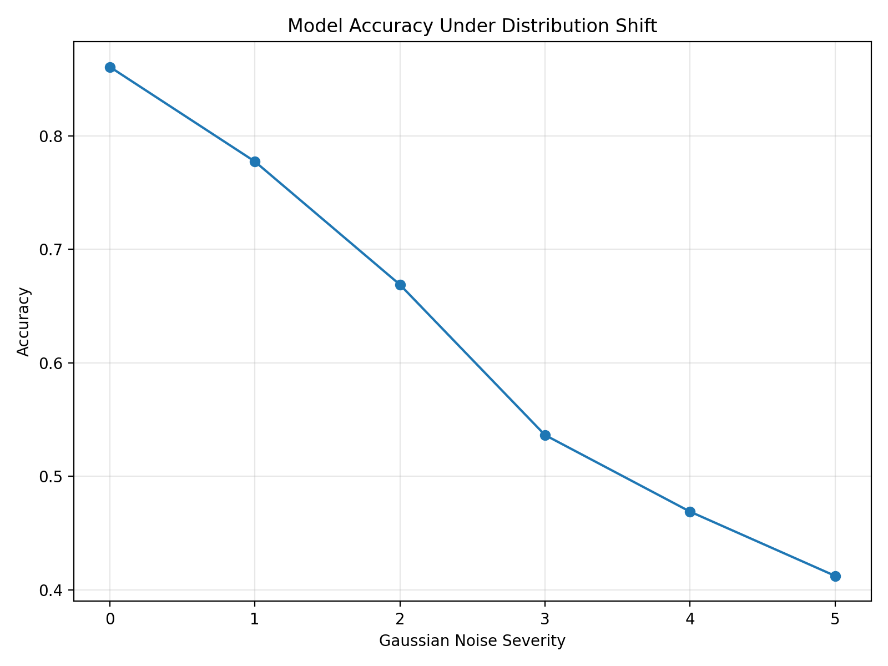
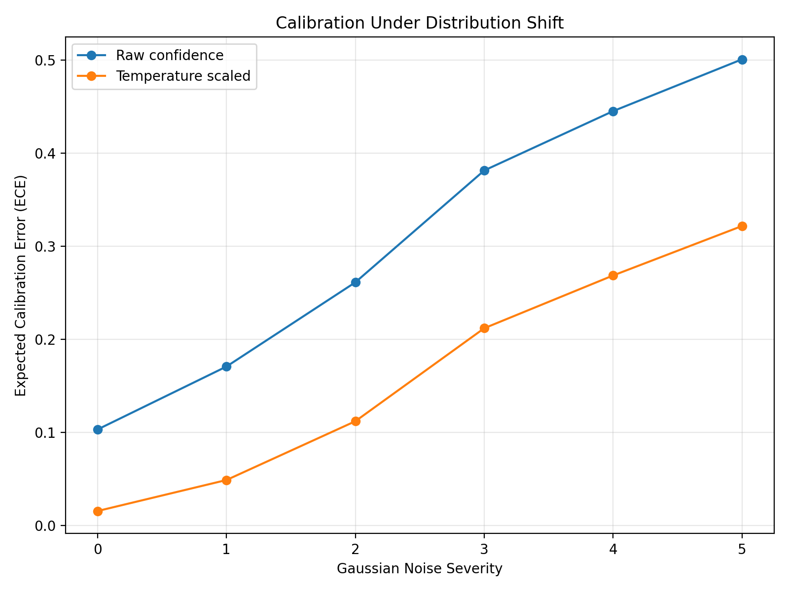
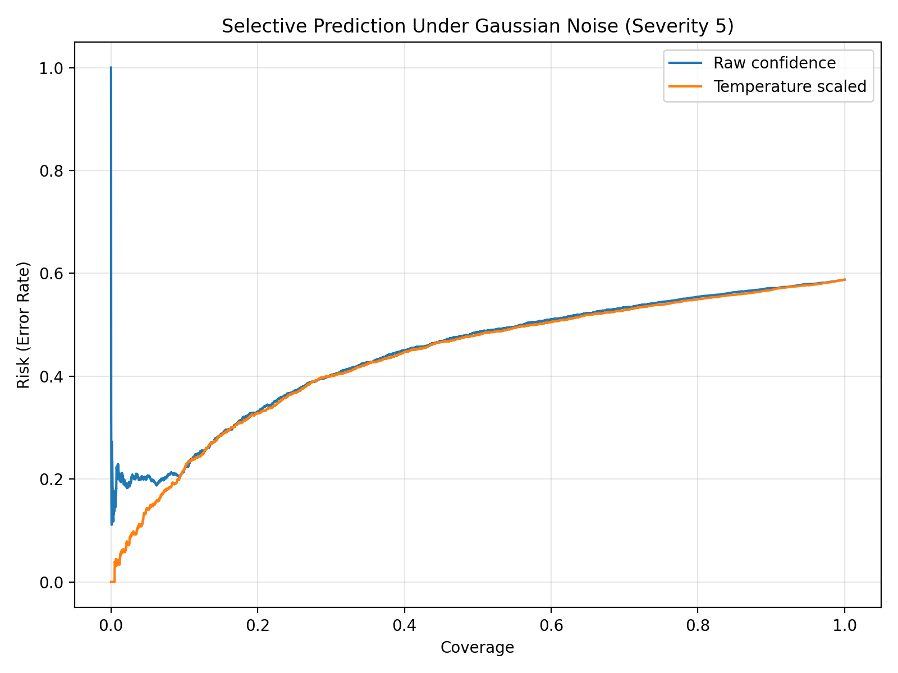

# Selective Prediction Under Distribution Shift

> **Can a classifier know when it should not be trusted?**

A practical investigation of **model calibration, uncertainty, selective prediction, and error detection under distribution shift** using ResNet18 on CIFAR-10 and Gaussian-noise corruptions from CIFAR-10-C.

---

## Overview

Modern neural networks can achieve strong performance on data that resembles their training distribution, yet become **confidently wrong** when the input distribution changes.

This project studies that failure mode by progressively corrupting CIFAR-10 test images with Gaussian noise and measuring how:

* classification accuracy changes,
* model confidence behaves,
* calibration deteriorates,
* confidence can be used for error detection, and
* selective prediction can control prediction risk.

The project also evaluates whether **temperature scaling**, a simple post-hoc calibration method, can make model confidence more reliable under distribution shift.

---

## Research Questions

The experiment is centered around four questions:

1. **How does model performance degrade as distribution shift increases?**
2. **Does model confidence remain trustworthy when accuracy deteriorates?**
3. **Can temperature scaling improve calibration under distribution shift?**
4. **Can confidence-based selective prediction and error detection identify unreliable predictions?**

---

## Motivation

A conventional evaluation might report:

> "The model achieves 86% accuracy."

But this does not answer an important deployment question:

> **What happens when the model encounters inputs that differ from what it saw during training?**

A particularly dangerous failure mode occurs when the model becomes less accurate **without becoming less confident**.

For a system making decisions in the real world, knowing **when not to trust a prediction** can be as important as improving raw accuracy.

This motivates the combination of:

**Distribution Shift → Calibration → Error Detection → Selective Prediction**

---

# Methodology

## 1. Base Classifier

A **ResNet18** classifier was trained on CIFAR-10.

### Training configuration

| Parameter           | Value             |
| ------------------- | ----------------- |
| Architecture        | ResNet18          |
| Parameters          | 11,173,962        |
| Training samples    | 45,000            |
| Calibration samples | 5,000             |
| Clean test samples  | 10,000            |
| Epochs              | 30                |
| Optimizer           | AdamW             |
| Learning rate       | 0.001             |
| Weight decay        | 0.0001            |
| Scheduler           | CosineAnnealingLR |
| Random seed         | 42                |

---

## 2. Post-Hoc Calibration

The model's confidence was calibrated using **temperature scaling**.

The learned temperature was:

```text
T = 2.9429
```

Temperature scaling modifies the model's logits before converting them into probabilities. It does **not** retrain the classifier or change its predicted class.

This allows us to separate two questions:

* **Is the prediction correct?**
* **How trustworthy is the confidence assigned to that prediction?**

---

## 3. Distribution Shift

To simulate distribution shift, the model was evaluated on **Gaussian-noise corruptions from CIFAR-10-C**.

Five corruption severities were evaluated:

```text
Severity 1 → Mild shift
Severity 2
Severity 3
Severity 4
Severity 5 → Severe shift
```

The dataset itself is not included in this repository.

---

## 4. Evaluation

The experiment evaluates multiple aspects of reliability:

### Predictive performance

* Accuracy

### Calibration

* Expected Calibration Error (ECE)
* Brier Score
* Average confidence

### Selective prediction

* Area Under the Risk-Coverage Curve (AURC)
* Risk at different coverage levels

### Error detection

* AUROC
* Average Precision (AP)

This provides a broader view of model reliability than accuracy alone.

---

# Results

## 1. Distribution Shift Dramatically Reduces Accuracy

The clean test accuracy was:

**86.08%**

Under progressively stronger Gaussian noise:

| Severity |   Accuracy |
| -------: | ---------: |
|    Clean | **86.08%** |
|        1 |     77.74% |
|        2 |     66.89% |
|        3 |     53.64% |
|        4 |     46.89% |
|        5 | **41.23%** |

The model loses almost half of its clean-test accuracy by the strongest corruption severity.



---

## 2. The Model Becomes Confidently Wrong

The most important result is the gap between **accuracy and confidence**.

At severity 5:

```text
Accuracy:         41.23%
Raw confidence:   91.30%
```

So the model is correct on fewer than half of the examples while still assigning an average confidence above 91%.

This is precisely the type of failure that accuracy alone cannot expose.

Temperature scaling reduces the average confidence:

```text
Raw confidence:          91.30%
Calibrated confidence:   73.40%
```

Calibration therefore makes the confidence signal substantially less extreme, although it does not completely eliminate miscalibration under severe shift.

---

## 3. Calibration Degrades Under Shift

On the clean test set:

| Metric      |    Raw | Calibrated |
| ----------- | -----: | ---------: |
| ECE         | 10.32% |  **1.55%** |
| Brier Score |  0.238 |  **0.201** |

Temperature scaling produces a large improvement on clean data.

However, the same calibration becomes less effective as the distribution moves further away from the training distribution.

### ECE under shift

| Severity | Raw ECE | Calibrated ECE |
| -------: | ------: | -------------: |
|        1 |  17.08% |      **4.88%** |
|        2 |  26.13% |     **11.20%** |
|        3 |  38.15% |     **21.19%** |
|        4 |  44.53% |     **26.87%** |
|        5 |  50.09% |     **32.18%** |



### Interpretation

Temperature scaling consistently improves calibration, but the remaining increase in ECE shows an important limitation:

> **Calibration learned on clean data does not guarantee reliable probabilities under a substantially shifted distribution.**

---

# Selective Prediction

Instead of forcing a model to predict every sample, **selective prediction** allows it to abstain from predictions it considers unreliable.

The experiment evaluates risk at multiple coverage levels:

```text
10%
25%
50%
75%
90%
```

At severity 5:

```text
Raw AURC:          0.4452
Calibrated AURC:   0.4347
```

The lower calibrated AURC indicates a modest improvement in the risk-coverage relationship.



The practical idea is:

```text
Input
  ↓
Model prediction + confidence
  ↓
Is confidence sufficient?
  ├── Yes → Accept prediction
  └── No  → Abstain / defer
```

This changes the objective from:

> "Predict everything as accurately as possible"

to:

> **"Make predictions when the model has sufficient evidence, and avoid high-risk predictions when it does not."**

---

# Error Detection

Model confidence can also be used as a signal for detecting whether a prediction is likely to be wrong.

### AUROC

| Severity |   Raw | Calibrated |
| -------: | ----: | ---------: |
|        0 | 0.884 |  **0.887** |
|        1 | 0.845 |  **0.850** |
|        2 | 0.782 |  **0.788** |
|        3 | 0.707 |  **0.715** |
|        4 | 0.684 |  **0.692** |
|        5 | 0.657 |  **0.666** |

Error detection becomes progressively harder as distribution shift increases.

Calibration provides a small but consistent improvement in AUROC across all severities.

Average Precision increases from **0.504 to 0.700** across the evaluated severity range; this metric should be interpreted together with the changing error prevalence and score distribution rather than as evidence that the model's overall reliability improves under stronger corruption.

---

# Key Findings

### 1. Accuracy can hide severe reliability problems

The model's accuracy falls from **86.08% to 41.23%**, while raw confidence remains above **91%** at the strongest shift.

A model can therefore become substantially less accurate without becoming obviously uncertain.

### 2. Temperature scaling substantially improves calibration

On clean data, ECE decreases from:

```text
10.32% → 1.55%
```

and Brier score improves from:

```text
0.238 → 0.201
```

### 3. Calibration does not solve distribution shift

Although calibrated confidence and ECE are consistently better than the raw model's values, calibration quality still deteriorates as corruption severity increases.

This demonstrates the distinction between:

**Calibration improvement**
and
**Robustness to distribution shift**

They are related, but not the same problem.

### 4. Selective prediction provides an additional safety mechanism

When every prediction does not need to be accepted, confidence can be used to trade **coverage for lower risk**.

This makes selective prediction particularly relevant for systems where uncertain predictions can be deferred to another process or human reviewer.

---

# Limitations

This experiment has several limitations:

* Only **Gaussian noise** from CIFAR-10-C was evaluated.
* Calibration was performed using clean-distribution data.
* The experiment uses a single ResNet18 model and a single random seed.
* Temperature scaling is a relatively simple post-hoc calibration method.
* The experiment does not evaluate real-world deployment or human/secondary-model fallback.
* Selective prediction is evaluated using confidence-based scoring rather than a learned abstention mechanism.

These limitations leave room for stronger distribution-shift and uncertainty experiments.

---

# Reproducibility

The complete experiment is contained in:

```text
selective_prediction_shift.ipynb
```

The notebook covers:

1. CIFAR-10 preparation
2. ResNet18 training
3. Temperature scaling
4. Clean-set calibration evaluation
5. CIFAR-10-C distribution-shift evaluation
6. Risk-coverage analysis
7. Error detection
8. Result visualization

Experiment outputs are stored in:

```text
results_summary.json
```

Generated figures are stored in:

```text
figures/
```

The CIFAR-10-C dataset is intentionally excluded from the repository because of its size and should be downloaded separately.

---

# Repository Structure

```text
selective-prediction-shift/
│
├── selective_prediction_shift.ipynb
├── results_summary.json
├── README.md
│
└── figures/
    ├── accuracy_vs_shift.png
    ├── ece_vs_shift.png
    └── risk_coverage_severity5.png
```

---

# Future Work

Possible extensions include:

* Evaluate multiple CIFAR-10-C corruption types rather than only Gaussian noise.
* Compare temperature scaling with **Dirichlet calibration, isotonic regression, or other calibration methods**.
* Compare different uncertainty scores for selective prediction.
* Evaluate **selective risk guarantees** under distribution shift.
* Investigate whether calibration performed using shifted validation data improves robustness.
* Compare multiple model architectures.
* Study stronger **OOD detection and uncertainty estimation** methods.

---

# Takeaway

The central lesson from this experiment is simple:

> **A model can be confidently wrong when the world changes.**

Distribution shift can cause accuracy to collapse while confidence remains high.

Calibration makes confidence more meaningful, but does not by itself make the model robust to distribution shift. Selective prediction provides another layer of reliability by allowing a system to **recognize uncertainty and abstain when appropriate**.

This makes model evaluation under distribution shift fundamentally different from simply reporting test-set accuracy.
